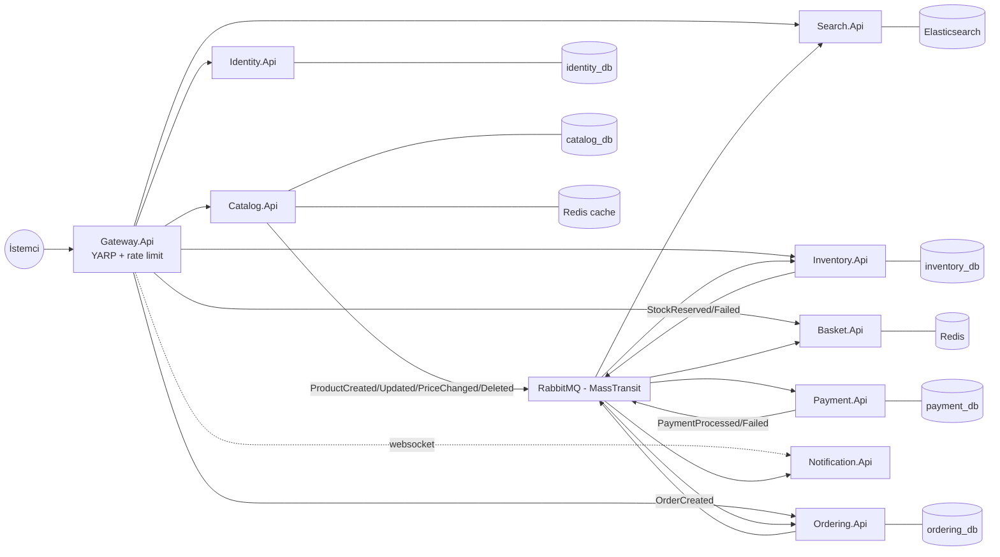
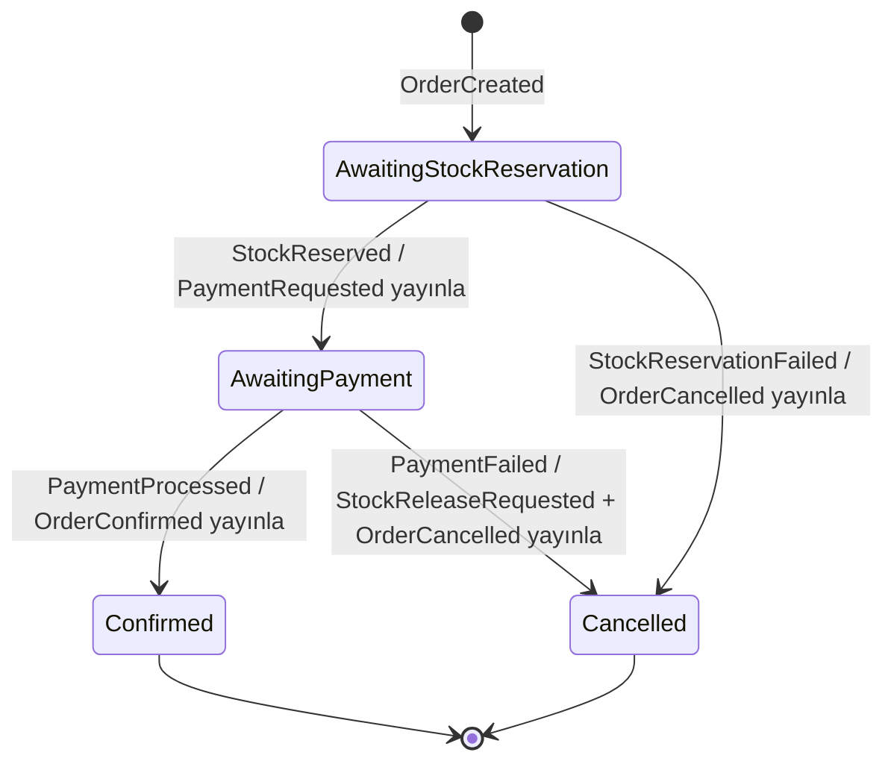

# Mimari

Bu doküman, platformun mimari kararlarını ve "neden böyle yapıldı" sorularının cevaplarını içerir.

## Genel Görünüm

## Order Saga (Orkestrasyon)

Sipariş yaşam döngüsünü `Ordering.Saga` içindeki MassTransit state machine yönetir. Saga state'i EF Core repository ile `ordering_db`'deki `OrderStates` tablosunda **persist edilir** — servis yeniden başlasa bile uçuştaki siparişler kaldığı yerden devam eder.

**Neden orkestrasyon (koreografi değil)?** Sipariş akışında sıralama kritik: ödeme, ancak stok rezerve edildikten sonra alınmalı. Saga bu sıralamayı tek noktadan garanti eder; akışın mevcut durumu her an sorgulanabilir (`OrderStates` tablosu) ve yeni adım eklemek (örn. kargo) tek yeri değiştirmek demektir.

**Compensating transaction:** Ödeme reddedilirse stok zaten düşülmüştür. Saga `StockReleaseRequested` yayınlar; Inventory rezervasyonları bulur, miktarları iade eder ve rezervasyon kayıtlarını siler. Dağıtık sistemde "rollback" yoktur — telafi edici aksiyon vardır.

**Sonucun projeksiyonu:** Saga `OrderConfirmed`/`OrderCancelled` yayınlar; `Ordering.Api` içindeki consumer'lar bu eventleri `Orders` tablosuna işler (Pending → Confirmed/Cancelled). Notification da aynı eventleri kendi kuyruğundan tüketip kullanıcıya SignalR + e-posta bildirimi gönderir.

## Transactional Outbox

**Problem (dual-write):** "DB'ye yaz + event yayınla" iki ayrı sistemdir; biri başarılı diğeri başarısız olursa sistemler birbirinden kopar (ürün var ama Search'te yok, sipariş var ama saga başlamadı).

**Çözüm:** MassTransit'in EF Core outbox'ı. `IPublishEndpoint.Publish` çağrısı mesajı RabbitMQ'ya değil, aynı DbContext transaction'ı içinde `OutboxMessage` tablosuna yazar. `SaveChangesAsync` başarılıysa hem veri hem event atomik olarak commit olmuştur; arka plandaki delivery servisi mesajı RabbitMQ'ya taşır. Catalog ve Ordering'de aktiftir; Inventory ve Payment'ta ayrıca **inbox** (consume tarafı) duplicate mesajları eler.

Test kanıtı: `tests/IntegrationTests/CatalogOutboxTests.cs` — `SaveChanges` çağrılmadan publish edilen mesajın iz bırakmadığını, çağrılınca entity + event'in birlikte commit olduğunu gerçek Postgres üzerinde doğrular.

## İdempotency ve Eşzamanlılık

- **MassTransit inbox** (Inventory, Payment, Ordering): aynı mesaj iki kez teslim edilirse ikincisi işlenmez.
- **Savunmacı kontroller:** Inventory `OrderId` için mevcut rezervasyon var mı diye bakar; Payment sipariş başına tek kayıt tutar (`OrderId` unique index) ve duplicate teslimatta *orijinal sonucu yeniden yayınlar* (tekrar tahsilat yapmaz).
- **Stok yarışları:** `StockItem`, Postgres `xmin` kolonu üzerinden optimistic concurrency kullanır; çakışan rezervasyonlar `DbUpdateConcurrencyException` fırlatır ve MassTransit retry (3 × 500ms) ile yeniden denenir.

## Güvenlik

- Identity.Api **RS256** ile imzalar; imza anahtarı ilk çalıştırmada üretilip PEM olarak saklanır (gitignore'lu `keys/`).
- Public key `/.well-known/jwks.json` üzerinden yayınlanır; OIDC discovery (`/.well-known/openid-configuration`) mevcuttur.
- **Her servis kendi doğrulamasını yapar** (`Jwt:Authority` üzerinden JWKS çeker). Gateway'e güvenmek yerine servis bazlı doğrulama, mikroservislerde tek hata noktasını ortadan kaldırır ve servislerin doğrudan çağrılmasını da güvenli kılar. Hiçbir serviste paylaşılan secret yoktur.
- Refresh token'lar DB'de saklanır ve **rotasyonludur**: kullanılan token revoke edilir, yenisi verilir; revoke edilmiş token'ın tekrar kullanımı 401 döner.
- Gateway'de IP başına fixed-window rate limiting (varsayılan 100 istek / 10 sn → 429).
- SignalR websocket bağlantıları Authorization header taşıyamadığı için hub rotalarında token `?access_token=` query parametresi ile alınır.

## Kuyruk İsimlendirme (öğrenilmiş ders)

MassTransit endpoint adını consumer sınıf adından türetir. `ProductCreatedConsumer` hem Search'te hem Inventory'de var — varsayılan isimlendirmeyle ikisi de `product-created` kuyruğuna bağlanır ve mesajları **paylaşıp yarışırlar** (her mesaj yalnızca birine gider). Bu yüzden her servis kendi önekini kullanır: `search-product-created`, `inventory-product-created`... Böylece her event, onu dinleyen her servise ayrı kuyruk üzerinden fan-out olur.

## Database-per-Service

Her servisin şeması yalnızca kendi servisinden erişilebilir; servisler arası veri alışverişi yalnızca event'lerle olur. Geliştirme kolaylığı için tek Postgres **container**'ında ayrı database'ler kullanılır (`docker/postgres/init-databases.sql`); üretimde her database ayrı instance/cluster'a taşınabilir — bağlantı dizesi değişikliğinden ibarettir.

## Gözlemlenebilirlik

| Katman | Araç | Not |
|---|---|---|
| Log | Serilog → Seq | Her kayıt `Service` özelliği ile zenginleştirilir; tüm sistem tek Seq'te |
| Trace | OpenTelemetry → OTLP → Jaeger | ASP.NET Core + HttpClient + `MassTransit` + `Npgsql` activity source'ları; bir siparişin Gateway→Ordering→RabbitMQ→Inventory→Payment izi tek trace'te görünür |
| Metrik | OpenTelemetry Prometheus exporter | Her serviste `/metrics`; Grafana'da hazır dashboard (RPS, p95, 5xx, aktif istek) |
| Sağlık | AspNetCore.HealthChecks | Her serviste bağımlılık kontrollü `/health`; Gateway'de `/healthchecks-ui` paneli |

## Bilinçli Sadeleştirmeler (gerçek sistemde farklı olurdu)

- **Kart numarası** `OrderCreated`/`PaymentRequested` mesajlarında düz taşınır — ödeme mock olduğu için. Gerçekte PCI kapsamı dışında kalmak için tokenizasyon kullanılır.
- **Sepet fiyatları** istemciden snapshot olarak alınır; gerçekte Catalog'dan doğrulanır.
- Clean Architecture katmanları yalnızca Identity, Catalog ve Ordering'de uygulanır; Search/Basket/Inventory/Payment/Notification tek projedir — küçük servise katman dayatmak maliyet üretir.
- Migration'lar servis açılışında otomatik uygulanır (dev kolaylığı); üretimde deploy pipeline'ında koşulur.
- MassTransit **8.4.x**'e sabitlidir: v9 ticari lisansa geçti, 8.5.x ise EF Core 9 bağımlılığı getirerek EF 8 + Npgsql 8 yığınıyla çakışıyor.
